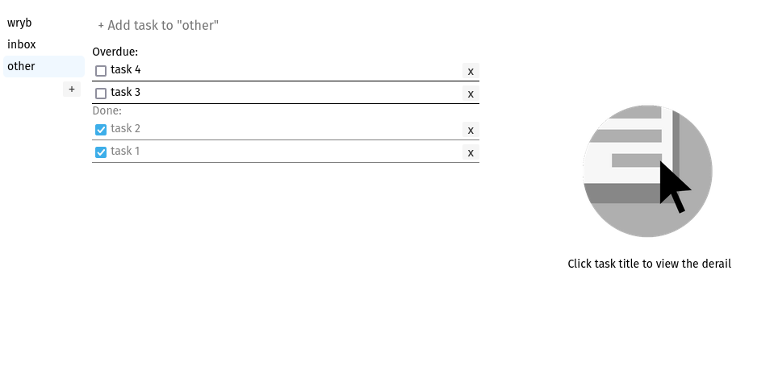

# Motivation

Test project to learn clojure.

# Usages

Simple todo list application.

Before using override sqlite file path in application.toml :

    [database]
    path = "/wryb.db" #if you use this app you have to rewrite this

Run:

    lein run

Ui will be allowed by localhost:3000

# Screenshots

